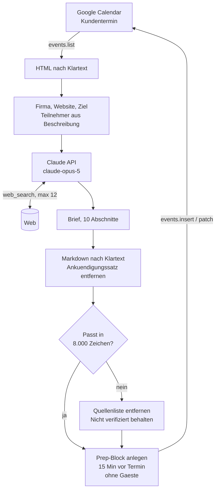
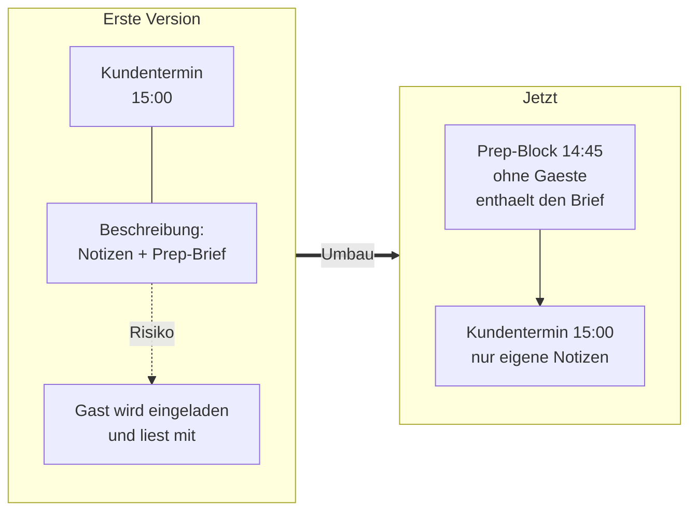

# Meeting-Prep-Agent

Liest einen Termin aus Google Calendar, recherchiert Firma und Ansprechpartner
im Web und legt einen belegten Prep-Brief als eigenen Kalenderblock 15 Minuten
vor dem Termin ab.

Gebaut als Teil der Kuro Founders-Associate-Challenge, Aufgabe 2.

## Architektur



### Warum zwei Termine statt einem



Der Brief ist internes Vertriebsmaterial. Gaeste eines Termins sehen dessen
Beschreibung. Ein eigenes Event ohne Gaeste schliesst den Fehler
strukturell aus, statt ihn nur per Konvention zu verbieten.

---

## Nutzung

```bash
python prep_agent.py --next                  # naechster Termin
python prep_agent.py --query "WOLFF"         # per Titel suchen
python prep_agent.py --query "WOLFF" --dry-run   # nur ausgeben
python prep_agent.py --query "WOLFF" --in-event  # in den Termin selbst schreiben
```

Der Termin braucht in der Beschreibung dieses Format:

```
Firma: WOLFF & MÜLLER Holding GmbH & Co. KG
Website: https://www.wolff-mueller.de
Ziel: Interesse an Projekt- & Risikoanalyse ausloten, POV positionieren
Teilnehmer:
- Michaela Schriever – https://www.linkedin.com/in/michaela-schriever/
- Matthias Wolf – https://www.linkedin.com/in/matthias-wolf-135076119/
```

Gaesteliste bleibt leer. Warum, steht weiter unten.

---

## Setup

**1. Google Calendar API**

Cloud Console → neues Projekt → Google Calendar API aktivieren →
Google Auth Platform konfigurieren (Zielgruppe: Extern) → Clients →
Client erstellen → Typ **Desktop-App** → JSON herunterladen als
`credentials.json` in den Projektordner.

**2. Python**

```bash
python3 -m venv venv && source venv/bin/activate
pip install anthropic google-api-python-client google-auth-oauthlib
export ANTHROPIC_API_KEY=sk-ant-...
```

Der Key muss einem Workspace zugeordnet sein, sonst antwortet die API mit
400 und verlangt einen `anthropic-workspace-id`-Header.

Beim ersten Lauf oeffnet sich der Browser fuer die OAuth-Freigabe. Die
Warnung "Google hat diese App nicht ueberprueft" ist erwartbar: es ist die
eigene App im Testing-Status. Danach liegt der Login in `token.json` und
der Browser bleibt zu.

---

## Architektur und Entscheidungen

### Python statt n8n oder Zapier

Der Wert dieses Agents steckt fast vollstaendig im Prompt, also in der
Definition, was ein guter Brief enthaelt. Ein visueller Workflow-Builder
haette daran nichts beschleunigt, aber Versionierung und Diff-Barkeit
verschlechtert. Ein Skript laeuft ausserdem lokal ohne Account-Abhaengigkeit.

### Claudes serverseitiges `web_search` statt eigener Such-Pipeline

Die Alternative waere Such-Provider plus Fetcher plus HTML-Extraktion
gewesen: drei zusaetzliche Fehlerquellen. Das eingebaute Tool laeuft
innerhalb desselben API-Calls und liefert Citations mit. Trade-off:
weniger Kontrolle darueber, *was* gesucht wird. Steuerung laeuft ueber
Prompt und `max_uses`.

### Kein LinkedIn-Scraping

Technisch fragil und ein ToS-Bruch. Die Profil-URL geht als Hinweis in den
Prompt, der Rest kommt aus oeffentlicher Websuche. Findet der Agent nichts
Belastbares, schreibt er das hin. Das ist ehrlicher als eine plausibel
klingende Erfindung, und in den Testlaeufen hat es funktioniert: zu einer
der beiden Personen gab es keinen abrufbaren Lebenslauf, und der Brief
sagt genau das, statt einen zu konstruieren.

### Teilnehmer aus der Beschreibung, nicht aus `attendees`

Erstens verbietet die Aufgabe, echte Ansprechpartner einzuladen. Zweitens
ist es der realistischere Fall: bei Erstgespraechen stehen die Leute der
Gegenseite selten als bestaetigte Gaeste im Event.

### Eigener Prep-Block statt Schreiben in den Kundentermin

Die erste Version schrieb den Brief in die Beschreibung des Kundentermins.
Beim Testen kam die Frage auf, wer das eigentlich liest. Der Brief ist
internes Vertriebsmaterial: Schmerz-Hypothesen, Einschaetzungen zum
Budgethebel einzelner Personen, vorbereitete Antworten auf Einwaende.
Gaeste eines Termins sehen dessen Beschreibung. Sobald jemand den Kunden
zum Folgetermin einlaedt, ginge der Brief mit raus.

Deshalb legt der Agent jetzt ein eigenes Event ohne Gaeste an, 15 Minuten
vor dem Termin. Der Fehler ist damit strukturell ausgeschlossen, statt nur
per Konvention verboten. Ueber die Eigenschaft `kuroPrepFor` findet der
Agent einen bestehenden Block wieder und aktualisiert ihn, statt einen
zweiten anzulegen. `--in-event` stellt das alte Verhalten wieder her.

---

## Was im Brief steht, und warum

Zehn Abschnitte, immer dieselben, in drei Gruppen:

| Gruppe | Abschnitte |
|---|---|
| Kontext | Worum es geht · Die Firma · Digitalisierungs-Signale |
| Menschen und Thesen | Gespraechspartner · Schmerz-Hypothesen · Discovery-Fragen |
| Munition | Passende Referenzen · Erwartbare Einwaende · Next-Step-Ask |
| Absicherung | Quellen · Nicht verifiziert |

Ein Prep-Brief, der Firmengeschichte und Gruendungsjahr zusammenfasst, ist
wertlos. Die Abschnitte sind danach gebaut, was eine Verkaufsentscheidung
tatsaechlich beeinflusst:

- **Digitalisierungs-Signale** statt Firmenportrait. Eine ausgeschriebene
  Stelle, die woertlich "Identifikation und Klaerung von Widerspruechen"
  verlangt, sagt mehr ueber Kaufbereitschaft als jede Umsatzzahl.
- **Hypothesen sind als Hypothesen markiert** und an ein konkretes Modul
  gekoppelt.
- **Ein Abschnitt "Nicht verifiziert" ist Pflicht.** In den POC-Interviews
  war genau das der Hauptkritikpunkt: die Antwort stimmt, aber die Quelle
  fehlt, und an einer Stelle wurde aus einem Beispielbild eine
  Tatsachenbehauptung. Ein Prep-Brief, der nicht zwischen belegt und
  vermutet trennt, ist im Vertrieb aktiv gefaehrlich.

Wenn der Platz im Kalenderfeld knapp wird, faellt zuerst die **Quellenliste**
weg, nie der Abschnitt "Nicht verifiziert". Was man nachschlagen kann, ist
verzichtbarer als das, was vor einer falschen Aussage im Termin schuetzt.

### Jeder Lauf findet etwas anderes

Fuenf Laeufe zur selben Firma haben unterschiedliche Fakten geliefert. Ein
Lauf fand RIB iTWO mit Belegen von 2011, ein anderer thinkproject mit
SAP-Anbindung, ein dritter den Start-up-Foerderer MORGENbau samt
KI-Investment. Zu einer der beiden Personen lieferte ein Lauf einen
Werdegang, ein spaeterer meldete das Profil als nicht abrufbar.

Das ist kein Bug, sondern die Natur von Websuche: andere Treffer, andere
Reihenfolge, andere Schwerpunkte. Es ist aber der Grund, warum der Brief
seine Quellen und Luecken offenlegen muss. Ein Agent, der bei jedem
Durchlauf gleich selbstbewusst klingt und trotzdem unterschiedliche Fakten
liefert, ist gefaehrlich. Einer, der sagt, worauf er sich stuetzt und was
er nicht belegen konnte, ist benutzbar.

Praktische Konsequenz: **vor einem echten Termin zwei bis drei Kernzahlen
selbst gegenpruefen.** Der Brief ersetzt keine Verifikation, er macht sie
nur schnell.

---

## Gefundene Fehler waehrend der Entwicklung

Drei Bugs, die erst im echten Betrieb sichtbar wurden:

1. **Google liefert Beschreibungen als HTML.** Zeilenumbrueche kommen als
   `<br>` an. Der Parser sah eine einzige lange Zeile und meldete null
   Teilnehmer, ohne abzustuerzen. Genau solche stillen Fehler sind das
   eigentliche Risiko bei Agents, und der Grund, warum `--dry-run`
   existiert.
2. **Zeichenlimit zu niedrig angesetzt.** Der Brief wurde gekappt,
   ausgerechnet im Abschnitt "Nicht verifiziert". Fuehrte zur oben
   beschriebenen Kuerzungsreihenfolge.
3. **Ganztaegige Termine hatten keinen Startzeitpunkt.** Das Skript brach
   ab, statt auf einen Standardzeitpunkt auszuweichen.

---

## Naechste Schritte

- **Brief kuerzen.** Die aktuelle Laenge ist zu hoch fuer den Zweck. Er wird
  zehn Minuten vor dem Termin auf dem Handy gelesen, nicht am Schreibtisch.
  Ziel: eine Bildschirmseite.
- Cron-Job, der abends alle Termine des Folgetags durchlaeuft
- Handelsregister und Bundesanzeiger fuer belastbare Finanzzahlen statt
  Pressemeldungen
- CRM-Anbindung: bisherige Kontakthistorie in den Brief
- Feedback-Schleife am Brief, um die Abschnittsstruktur zu schaerfen
